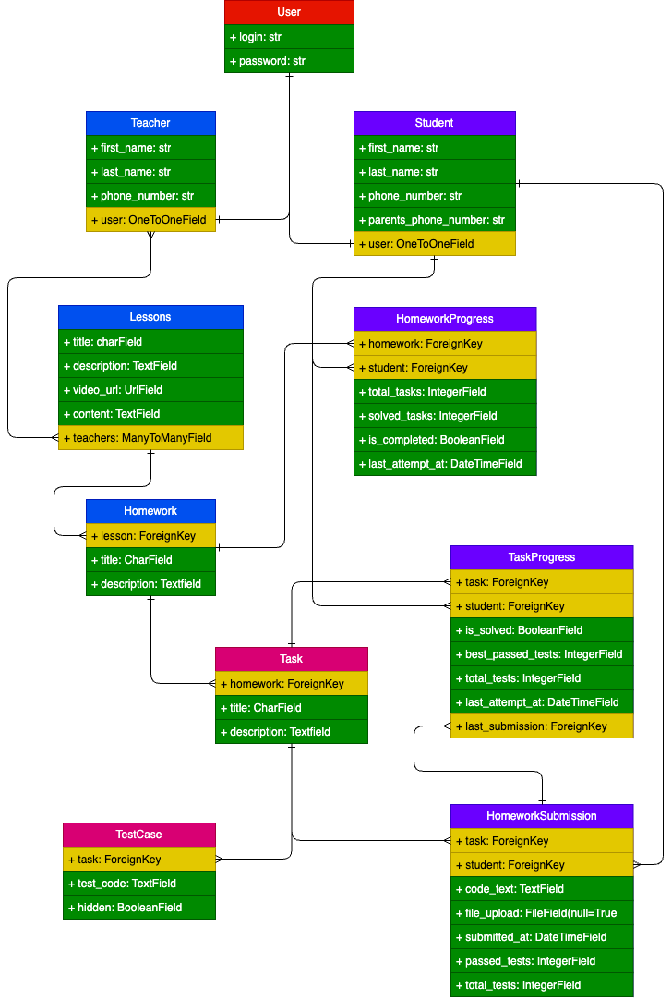

# CodeSchool Backend 🎓

A Django REST API backend for an online coding education platform that allows teachers to create lessons, assign homework, track student progress, and evaluate code submissions.

## 📊 Database Schema



## 🚀 Features

- **User Management**: Custom user authentication with Teacher and Student profiles
- **Course Management**: Lessons with video content and descriptions
- **Assignment System**: Homework and task creation with automated testing
- **Progress Tracking**: Real-time student progress monitoring
- **Code Submissions**: File upload and code evaluation system
- **Admin Interface**: Comprehensive Django admin for content management

## 🛠️ Tech Stack

- **Django 5.2**: Web framework
- **Django REST Framework**: API development
- **SQLite**: Database (development)
- **Django CORS Headers**: Cross-origin resource sharing
- **drf-yasg**: API documentation with Swagger

## 📁 Project Structure

```
apps/
├── accounts/          # User management & authentication
├── courses/           # Academic content management
├── assignments/       # Assignment and task system
├── progress/          # Student progress tracking
├── submissions/       # Code submission & evaluation
└── editor/            # Code editor interface
```

## 🔧 Setup

### Prerequisites
- Python 3.8+
- pip

### Installation

1. **Clone the repository**
```bash
git clone <repository-url>
cd codeschool_backend
```

2. **Create virtual environment**
```bash
python -m venv env
source env/bin/activate  # On Windows: env\Scripts\activate
```

3. **Install dependencies**
```bash
pip install -r requirements.txt
```

4. **Run migrations**
```bash
python manage.py migrate
```

5. **Create superuser**
```bash
python manage.py createsuperuser
```

6. **Start development server**
```bash
python manage.py runserver
```

The server will be available at `http://localhost:8000`

## 📚 API Documentation

Once the server is running, visit:
- Swagger UI: `http://localhost:8000/swagger/`
- ReDoc: `http://localhost:8000/redoc/`

## 🏗️ Models Overview

### User System
- **User**: Custom authentication with login/password
- **Teacher**: Profile with contact information
- **Student**: Profile with parent contact details

### Educational Content
- **Lessons**: Video-based lessons with descriptions
- **Homework**: Assignments linked to lessons
- **Task**: Individual coding tasks within homework

### Progress & Evaluation
- **HomeworkProgress**: Student completion tracking
- **TaskProgress**: Individual task progress with test results
- **HomeworkSubmission**: Code submissions with evaluation
- **TestCase**: Automated test cases for code validation

## 🔑 Key Features

### For Teachers
- Create and manage lessons
- Assign homework with multiple tasks
- Track student progress in real-time
- Review and evaluate code submissions

### For Students
- Access assigned lessons and homework
- Submit code solutions
- Track personal progress
- View test results and feedback

## 🔐 Authentication

The system uses Django's token-based authentication:
- Register/Login to receive authentication token
- Include token in API requests: `Authorization: Token <your-token>`

## 🚦 Development

### Running Tests
```bash
python manage.py test
```

### Admin Interface
Access Django admin at `http://localhost:8000/admin/` with your superuser credentials.

---

**Built with ❤️ using Django**
